Discogan
======================

dataset 
---------
1. facades
2. edges2shoes
3. edges2handbags

* dataset link: https://people.eecs.berkeley.edu/~tinghuiz/projects/pix2pix/datasets/

#### edges2shoes dataset

<table align='center'>
<tr align='center'>
 <td> pytorch implementaion(iteration = 8950,batch_size 200)</td>
 </tr>
<tr align='center'>
 <td>A</td>
 <td>AB</td>
 <td>ABA</td>
 </tr>
<tr>
 <td>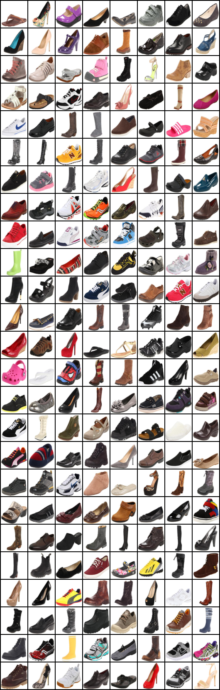</td>
 <td>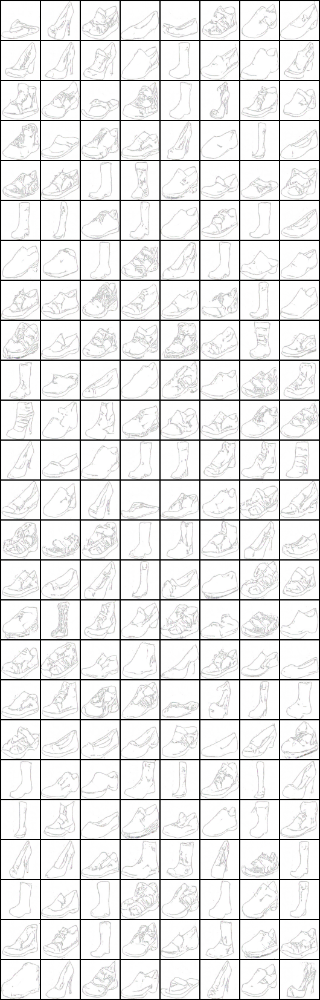</td>
 <td>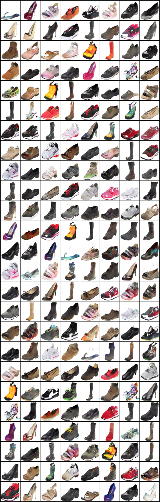</td>
</tr>
<tr align='center'>
 <td> B</td>
 <td> BA</td>
 <td> BAB</td>
 </tr>
<tr>
 <td>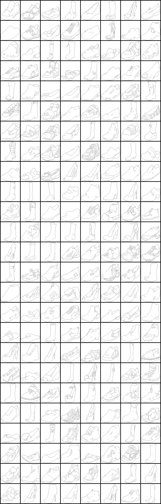</td>
 <td>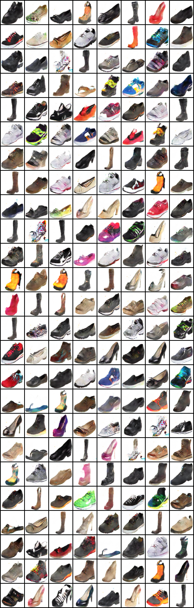</td>
 <td>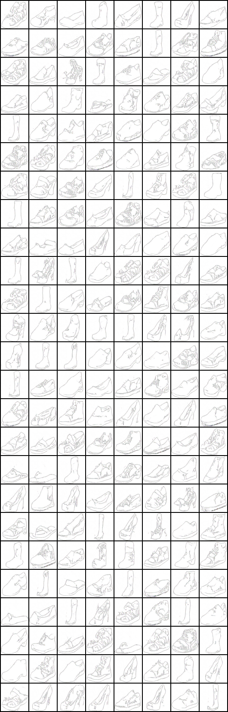</td>
</tr>
</table>

#### edges2handbags dataset

<table align='center'>
<tr align='center'>
 <td> pytorch implementaion(iteration = 173850,batch_size= 200)</td>
 </tr>
<tr align='center'>
 <td>A</td>
 <td>AB</td>
 <td>ABA</td>
 </tr>
<tr>
 <td></td>
 <td>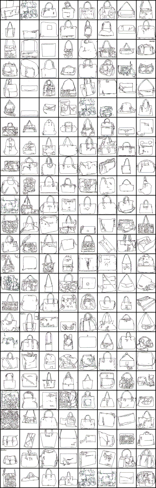</td>
 <td>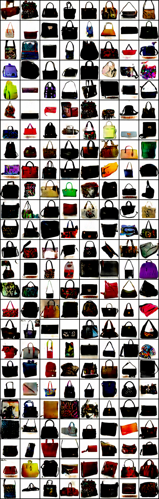</td>
</tr>
<tr align='center'>
 <td> B</td>
 <td> BA</td>
 <td> BAB</td>
 </tr>
<tr>
 <td></td>
 <td>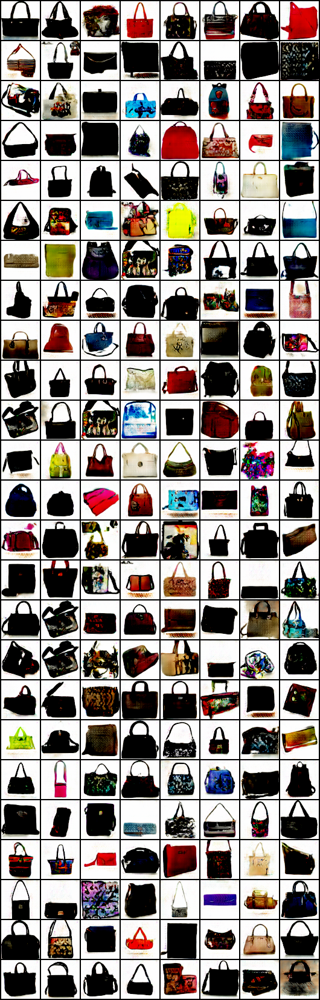</td>
 <td>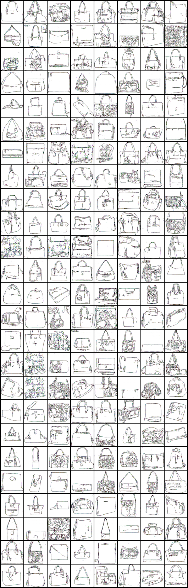</td>
</tr>
</table>

#### shoes2handbags dataset

<table align='center'>
<tr align='center'>
 <td> pytorch implementaion(iteration = 15450,batch_size= 200)</td>
 </tr>
<tr align='center'>
 <td>A</td>
 <td>AB</td>
 <td>ABA</td>
 </tr>
<tr>
 <td>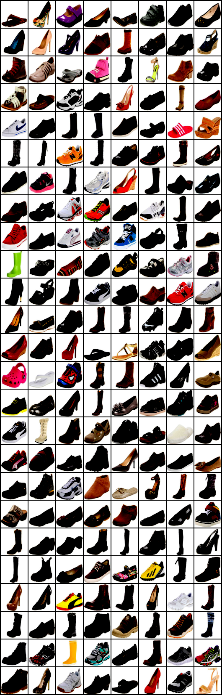</td>
 <td></td>
 <td></td>
</tr>
<tr align='center'>
 <td> B</td>
 <td> BA</td>
 <td> BAB</td>
 </tr>
<tr>
 <td>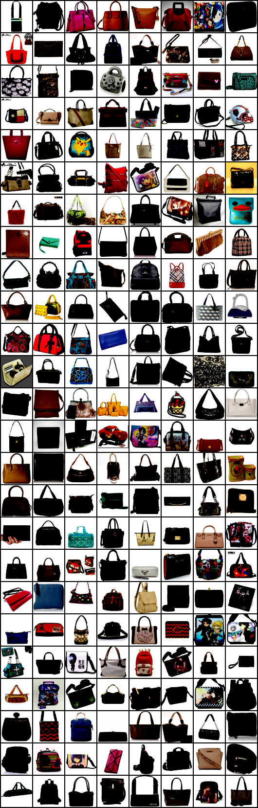</td>
 <td></td>
 <td></td>
</tr>
</table>

> Using Pix2pix's unet and combination of LSGAN and L1 For Lconst loss
> > Can train some dataset for 256 x 256 image size(discogan_pytorch_gpu_torloader_deep.py)

#### edges2shoes dataset

<table align='center'>
<tr align='center'>
 <td> pytorch implementaion(iteration = 23916,batch_size= 25)</td>
 </tr>
<tr align='center'>
 <td>A</td>
 <td>AB</td>
 <td>ABA</td>
 </tr>
<tr>
 <td></td>
 <td></td>
 <td></td>
</tr>
<tr align='center'>
 <td> B</td>
 <td> BA</td>
 <td> BAB</td>
 </tr>
<tr>
 <td></td>
 <td></td>
 <td></td>
</tr>
</table>

#### facades dataset

<table align='center'>
<tr align='center'>
 <td> pytorch implementaion(epoch = 106,batch_size= 25)</td>
 </tr>
<tr align='center'>
 <td>A</td>
 <td>AB</td>
 <td>ABA</td>
 </tr>
<tr>
 <td></td>
 <td></td>
 <td></td>
</tr>
<tr align='center'>
 <td> B</td>
 <td> BA</td>
 <td> BAB</td>
 </tr>
<tr>
 <td></td>
 <td></td>
 <td></td>
</tr>
</table>

#### facades dataset

<table align='center'>
<tr align='center'>
 <td> pytorch implementaion(epoch = 106,batch_size= 25)</td>
 </tr>
<tr align='center'>
 <td>A</td>
 <td>AB</td>
 <td>ABA</td>
 </tr>
<tr>
 <td></td>
 <td></td>
 <td></td>
</tr>
<tr align='center'>
 <td> B</td>
 <td> BA</td>
 <td> BAB</td>
 </tr>
<tr>
 <td></td>
 <td></td>
 <td></td>
</tr>
</table>

### NOT GOOD CASE

#### apple2orange dataset

<table align='center'>
<tr align='center'>
 <td> pytorch implementaion(epoch = 200,batch_size= 25)</td>
 </tr>
<tr align='center'>
 <td>A</td>
 <td>AB</td>
 <td>ABA</td>
 </tr>
<tr>
 <td></td>
 <td></td>
 <td></td>
</tr>
<tr align='center'>
 <td> B</td>
 <td> BA</td>
 <td> BAB</td>
 </tr>
<tr>
 <td></td>
 <td></td>
 <td></td>
</tr>
</table>

#### zebra2horse dataset

<table align='center'>
<tr align='center'>
 <td> pytorch implementaion(epoch = 299,batch_size= 25)</td>
 </tr>
<tr align='center'>
 <td>A</td>
 <td>AB</td>
 <td>ABA</td>
 </tr>
<tr>
 <td></td>
 <td></td>
 <td></td>
</tr>
<tr align='center'>
 <td> B</td>
 <td> BA</td>
 <td> BAB</td>
 </tr>
<tr>
 <td></td>
 <td></td>
 <td></td>
</tr>
</table>

> My codes are heavily rely on https://github.com/carpedm20/DiscoGAN-pytorch
Special thanks to carpedm20

## Reference

1. Isola, Phillip, et al. "Image-to-image translation with conditional adversarial networks."
(Full paper: https://arxiv.org/pdf/1611.07004.pdf)
Unpaired Image-to-Image Translation using Cycle-Consistent Adversarial Networks
(arXiv:1703.10593 [cs.CV])
2. Learning to Discover Cross-Domain Relations with Generative Adversarial Networks
(arXiv:1703.05192 [cs.CV])
3. DualGAN: Unsupervised Dual Learning for Image-to-Image Translation	
(arXiv:1704.02510 [cs.CV])
4. https://github.com/SKTBrain/DiscoGAN
5. https://github.com/carpedm20/DiscoGAN-pytorch
6. https://github.com/duxingren14/DualGAN
7. https://github.com/junyanz/CycleGAN
8. https://github.com/znxlwm/pytorch-CycleGAN
9. https://github.com/togheppi/DualGAN

